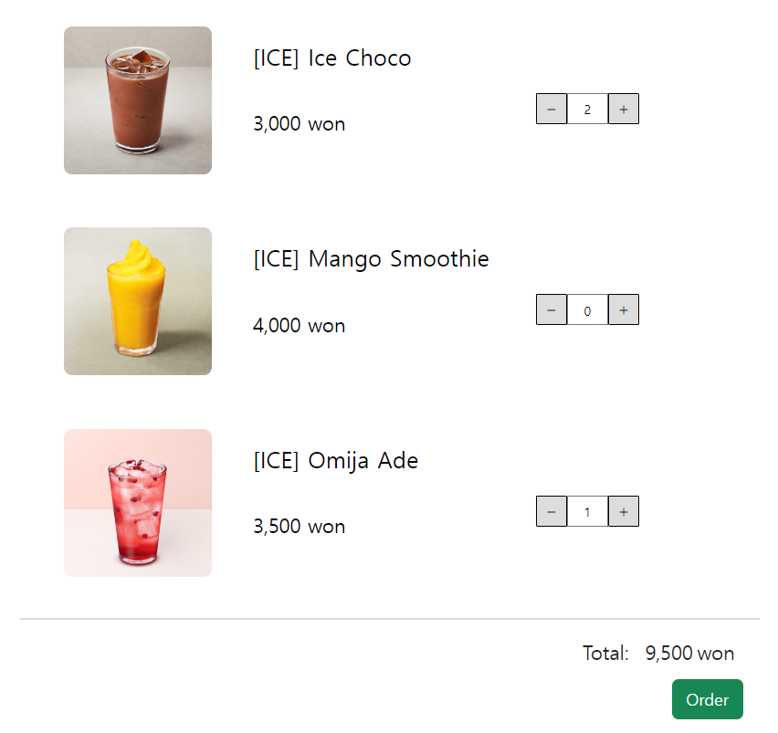
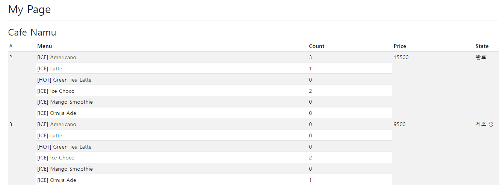
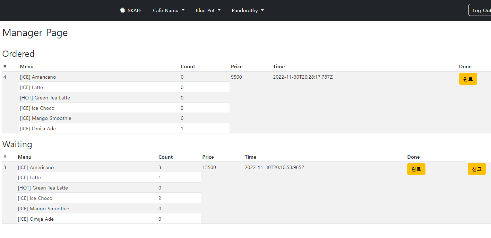
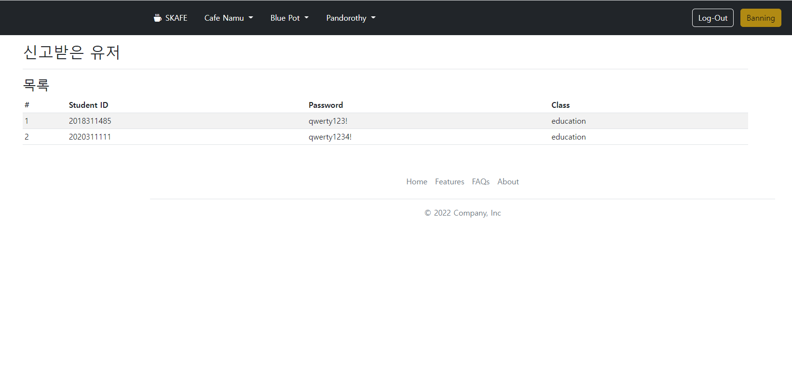

# OpenSource_Final_Project

## SKAFE (CAFE Campus)
> SKKU(자연과학캠퍼스) 교내 카페들에 대한 스마트 오더 시스템을 구축 

## Installation
``` bash
npm install
```

## How to use
### server
``` bash
npm start
```
### client
- http://localhost:5500/ 으로 Main Page 접속  
- 회원가입
  1. 카페 관리자 - ID: **9000000000-9999999999**, Password: 8자리 이상~16자리 이하 / 숫자와 특수문자가 포함되어야 한다.
  1. 고객 - ID: **학번**, Password: 8자리 이상~16자리 이하 / 숫자와 특수문자가 포함되어야 한다.

- 기능 
  - 고객
    1. 각 카페별 메뉴 확인 및 주문 기능
    1. 각 카페별 위치 지도로 확인
    1. My Page에서 주문 현황 확인
  - 카페 관리자
    1. 주문 확인 및 음료 완성 알림 기능
    1. 고객이 픽업 완료한 주문 clear하는 기능
    1. No-show 고객 신고 기능
  - Admin
    1. 신고가 접수되어 Ban된 사용자를 확인할 수 있다.

## Screenshots
- **고객**
  1. 주문 페이지  
      

  1. My page - 주문 현황 확인  
      

- **카페 관리자** - 미완료 주문 / 완료된 주문  
      

- **Admin** - 신고 내역 확인  
      

## Youtube Link
https://youtu.be/OkiQl_mJS78
